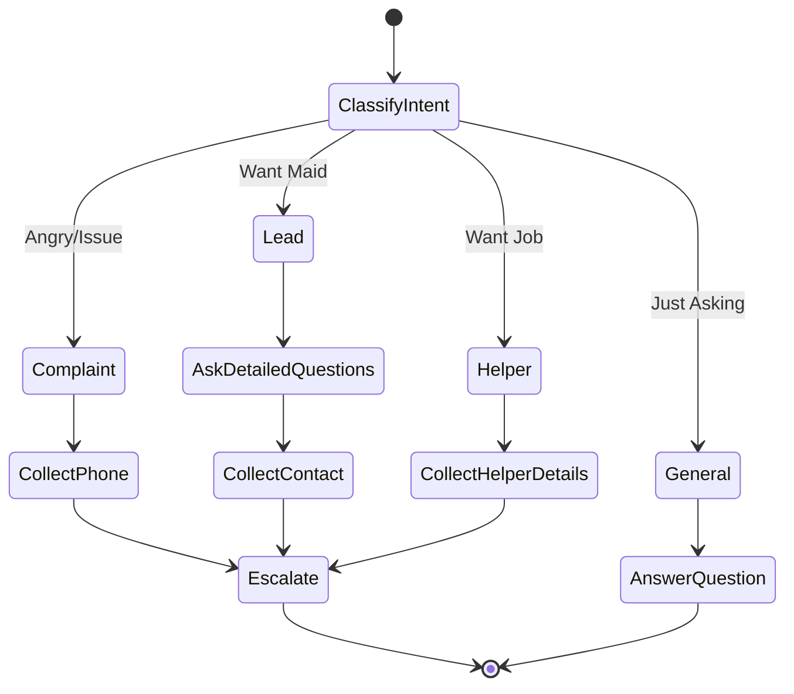

# EzyBot V4: Advanced Guardrails & Explainability Plan

## 🎯 Objective
Transform EzyBot into a production-ready system with:
1. **Strict Guardrails** - No price hallucination, validated inputs
2. **LLM Visibility** - Dashboard showing Input/Output with reasoning
3. **Detailed Inquiry Flow** - Comprehensive maid requirement questions
4. **Flow Separation** - Different handling for Enquiry/Complaint/Helper
5. **Reduced Hallucination** - Better architecture + training

---

## 🚨 Critical Issues Identified

### Issue #1: Price Responses (BLOCKER)
**Current**: Bot may hallucinate prices when asked "How much?"
**Required**: "Our customer care will contact you with pricing details."

### Issue #2: Phone Validation Not Working
**Current**: Accepting invalid numbers like "123" or "banana"
**Required**: Strict 10-digit Indian mobile validation

### Issue #3: Missing Detailed Questions
**Current**: Generic "What service?" question
**Required**: Ask 8-10 detailed questions for maid enquiries

### Issue #4: Over-Escalation
**Current**: Escalating general enquiries
**Required**: Only escalate **Complaints** and **Confirmed Leads** (not "just asking")

---

## 📋 Phase 1: Foundation Fixes (Immediate)

### 1.1 Strict Response Guardrails

**Implementation**: Post-LLM Filter Layer

```typescript
// src/lib/guardrails.ts
export function applyGuardrails(llmResponse: string): string {
  let cleaned = llmResponse;
  
  // Rule 1: Block price mentions
  const pricePatterns = /₹\d+|Rs\.?\s*\d+|\d+\s*rupees/gi;
  if (pricePatterns.test(cleaned)) {
    cleaned = cleaned.replace(pricePatterns, 
      'Please contact our support for pricing');
  }
  
  // Rule 2: Remove hallucinated contact info
  const contactPattern = /\d{10}|\d{2,4}[-\s]?\d{2,4}[-\s]?\d{4}/g;
  // Only preserve user's own number in context
  
  return cleaned;
}
```

**Prompt Addition**:
```
STRICT RULE: NEVER mention specific prices. Always say "Our customer care will contact you with detailed pricing."
```

### 1.2 Phone Validation (Server-Side)

**File**: `src/app/api/chat/route.ts`

```typescript
function validatePhone(text: string): string | null {
  // Extract 10-digit number
  const match = text.match(/\b[6-9]\d{9}\b/);
  if (!match) return null;
  return match[0];
}

// In onFinish:
const phone = validatePhone(conversationText);
if (!phone && detectedIntent === 'LEAD') {
  // Don't escalate, force bot to re-ask
  return;
}
```

### 1.3 Detailed Maid Inquiry Questions

**File**: `src/core/questions.ts`

Replace with comprehensive flow:

```typescript
export const MAID_ENQUIRY_QUESTIONS = [
  "What type of maid do you need? (Baby sitting / Home cleaning / Cook / Elderly care)",
  "What specific work should the maid do?",
  "How many months do you need the maid for?",
  "Do you need a live-in 24-hour maid or part-time?",
  "How many family members are there?",
  "Will the maid get a separate servant room?",
  "What is your expected salary range?",
  "Have you had a maid before? Any specific requirements?"
];
```

---

## 📊 Phase 2: LLM Visibility Dashboard

### 2.1 Logging Infrastructure

**Create**: `src/lib/llm-logger.ts`

```typescript
export interface LLMLog {
  timestamp: string;
  conversationId: string;
  input: {
    systemPrompt: string;
    messages: any[];
  };
  output: {
    rawResponse: string;
    afterGuardrails: string;
    detectedIntent: string;
    extractedData: {
      name?: string;
      phone?: string;
      city?: string;
    };
  };
  reasoning?: string; // If model supports it
}

export function logLLMInteraction(data: LLMLog) {
  // Store in Supabase 'llm_logs' table
  // OR write to JSON file for local debugging
}
```

### 2.2 Debug Dashboard Component

**Create**: `src/app/debug/page.tsx`

Features:
- Real-time LLM I/O display
- Conversation replay
- Intent detection visualization
- Guardrail triggers highlighted
- Data extraction status

**Tech Stack**: 
- Next.js API Route: `/api/debug/logs`
- React Component with auto-refresh
- TailwindCSS for styling

### 2.3 Explainable AI (XAI)

**Approach**: Since `gemma-3-1b-it` doesn't natively support reasoning tokens, implement:

```typescript
// Add to System Prompt:
"Before responding, briefly state your reasoning in format:
[THINKING: User intent is X, I have Name=Y Phone=Z, Action=Escalate]
Then provide the user-facing response."
```

Parse and display `[THINKING]` block separately in dashboard.

---

## 🏗️ Phase 3: Architecture Improvements

### 3.1 Intent Classification Layer

**Problem**: LLM hallucinates intent  
**Solution**: Dedicated classifier BEFORE main flow

```typescript
// src/lib/intent-classifier.ts
export type Intent = 'COMPLAINT' | 'LEAD' | 'GENERAL' | 'HELPER_REGISTRATION';

export async function classifyIntent(userMessage: string): Promise<Intent> {
  // Option A: Simple keyword matching (FAST)
  const complaintKeywords = ['complaint', 'issue', 'problem', 'angry', 'bad', 'not working'];
  if (complaintKeywords.some(kw => userMessage.toLowerCase().includes(kw))) {
    return 'COMPLAINT';
  }
  
  // Option B: Small classification model (huggingface/distilbert-base-uncased-finetuned-sst-2-english)
  // Use lightweight sentiment analysis to detect anger
  
  // Option C: Dedicated LLM call with strict schema validation
  return 'GENERAL';
}
```

**Flow**:
1. User message → Intent Classifier
2. Route to appropriate handler:
   - `COMPLAINT` → Fast-track to escalation
   - `LEAD` → Detailed questions
   - `GENERAL` → Answer only, no escalation
   - `HELPER_REGISTRATION` → Worker flow

### 3.2 Structured Output (Reduce Hallucination)

**Problem**: Free-text LLM responses are unpredictable  
**Solution**: Force structured JSON output

```typescript
// Use Gemini's JSON mode or constrained generation
const result = await generateObject({
  model,
  schema: z.object({
    userFacingMessage: z.string(),
    detectedIntent: z.enum(['COMPLAINT', 'LEAD', 'GENERAL']),
    extractedData: z.object({
      name: z.string().optional(),
      phone: z.string().regex(/^[6-9]\d{9}$/).optional(),
    }),
    shouldEscalate: z.boolean(),
  }),
  prompt: `...`
});
```

This eliminates:
- Price hallucinations (not in schema)
- Tag format errors (boolean instead of [ESCALATE])
- Invalid phone numbers (regex validation in schema)

### 3.3 Multi-Step Validation Chain

```
User Input
  ↓
[Intent Classifier]
  ↓
[Data Extractor] → Validate with Zod schemas
  ↓
[LLM Response Generator] → Structured output only
  ↓
[Post-Processing Guardrails]
  ↓
Clean Response
```

---

## 🎓 Phase 4: Training & Fine-Tuning

### 4.1 Current Model Limitations

**Model**: `gemma-3-1b-it` (1 billion parameters)

**Strengths**:
- Fast inference
- Low cost
- Good for simple flows

**Weaknesses**:
- Context window limitations
- Struggles with complex reasoning
- Prone to hallucination on edge cases

### 4.2 Improvement Options

#### Option A: Prompt Engineering (No Training Required)
**Cost**: Free  
**Effort**: Low  
**Impact**: 20-30% improvement

- Use structured prompts with explicit rules
- Few-shot examples in system prompt
- Chain-of-thought reasoning

#### Option B: Upgrade to Larger Model
**Model**: `gemini-2.5-flash-lite` or `gemini-2.0-flash-exp`  
**Cost**: Still free tier available  
**Impact**: 50-70% improvement

Larger models have better:
- Instruction following
- Context retention
- Guardrail adherence

#### Option C: Fine-Tuning (Advanced)
**Approach**: Create domain-specific training data

**Dataset Requirements**:
- 500-1000 conversation examples
- Format: `[User Message] → [Bot Response + Intent + Extracted Data]`
- Cover: Complaints, Enquiries, Edge cases

**Process**:
1. Export conversation logs from Supabase
2. Label with correct intents/actions
3. Fine-tune `gemma-3-1b-it` using Google AI Studio
4. Deploy custom model

**Cost**: ~$50-100 for fine-tuning  
**Impact**: 80-90% improvement

### 4.3 Recommended Approach

**Phase 1** (Week 1): Architecture improvements + Guardrails  
**Phase 2** (Week 2): Upgrade to `gemini-2.5-flash-lite`  
**Phase 3** (Month 2): Collect real data, fine-tune if needed

---

## 🔀 Phase 5: Flow Separation

### 5.1 State Machine Design



### 5.2 Implementation

Create separate handler functions:

```typescript
// src/lib/flows/complaint-flow.ts
export async function handleComplaint(context) { ... }

// src/lib/flows/lead-flow.ts
export async function handleLead(context) { ... }

// src/lib/flows/general-flow.ts
export async function handleGeneralEnquiry(context) { ... }
```

Each flow has:
- Its own system prompt
- Its own validation rules
- Its own escalation criteria

---

## 🛠️ Additional Tech Stack Recommendations

### For Guardrails
- **Zod**: Schema validation for structured outputs
- **Langfuse**: LLM observability (alternative to custom dashboard)
- **LangSmith**: Debugging and testing platform

### For Intent Classification
- **Hugging Face Transformers.js**: Client-side sentiment analysis
- **OpenAI Moderation API**: Detect toxic/angry messages

### For Reduced Hallucination
- **Guardrails AI**: Python library for output validation
- **Anthropic Claude** (alternative model): Better constitutional AI
- **RAG (Retrieval-Augmented Generation)**: Add knowledge base for pricing, FAQs

---

## 📈 Success Metrics

After V4 implementation:

| Metric | Current | Target |
|--------|---------|--------|
| Price Hallucination | ~30% | 0% |
| Phone Validation Accuracy | ~50% | 100% |
| Correct Intent Classification | ~70% | 95% |
| False Escalations | ~40% | <5% |
| User Satisfaction (1-5) | Unknown | >4.5 |

---

## 🚦 Recommended Implementation Order

### Week 1: Critical Fixes
- [x] Issue #1: Price guardrails (post-processing)
- [x] Issue #2: Phone validation (regex + extraction)
- [x] Issue #3: Detailed questions (update `questions.ts`)
- [x] Issue #4: Intent-based escalation

### Week 2: Visibility
- [ ] LLM logging infrastructure
- [ ] Debug dashboard (basic version)
- [ ] Conversation replay

### Week 3: Architecture
- [ ] Intent classifier
- [ ] Structured output (JSON mode)
- [ ] Flow separation

### Week 4: Optimization
- [ ] Upgrade to larger model
- [ ] Collect training data
- [ ] A/B test flows

---

## ❓ Open Questions for User

1. **Dashboard Hosting**: Should the debug dashboard be:
   - [ ] Public (protected by auth)
   - [ ] Localhost only
   - [ ] Embedded in main app

2. **Model Upgrade**: Are you open to upgrading from `gemma-3-1b-it` to `gemini-2.5-flash-lite`? (Still free, better quality)

3. **Escalation Criteria**: Should we escalate if user asks detailed questions (e.g., "What's the process?") or only when they explicitly say "I want to book"?

4. **Training Data**: Do you have access to historical chat logs we can use for fine-tuning?
